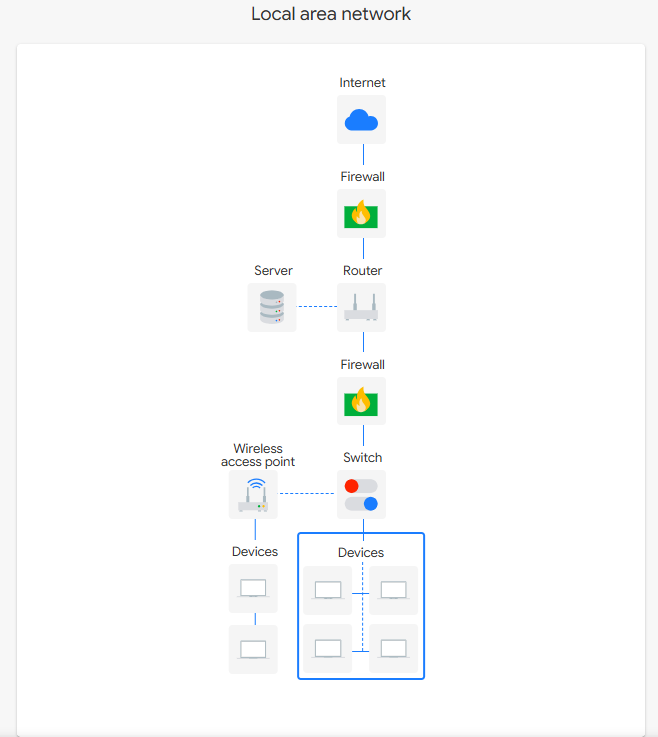

# Network Architecture Design & Security Boundary Review

## 📐 Network Topology & Component Breakdown

## 📌 Executive Summary
This document outlines the security architecture and structural design of a Local Area Network (LAN) engineered to protect internal corporate assets from external network threats. The design implements strict perimeter defenses and internal segmentation to enforce defense-in-depth principles.

---

## 🔍 Component Breakdown & Security Objectives

### 1. Boundary Defense (Firewall)
*   **Placement:** Deployed at the immediate perimeter between the public internet and the internal router.
*   **Security Objective:** Acts as the primary line of defense to filter inbound and outbound traffic based on defined security rulesets (ACLs), blocking unauthorized access attempts before they hit the internal network.

### 2. Network Routing (Router)
*   **Placement:** Positioned immediately behind the primary firewall.
*   **Security Objective:** Directs traffic dynamically between different internal subnets and manages external data traffic heading toward the public internet gateway.

### 3. Local Segmentation (Switches)
*   **Placement:** Deployed within internal segments behind the router.
*   **Security Objective:** Facilitates fast, localized communication between end-user workstations and internal servers, ensuring that broadcast domains are contained and network sniffing risks are minimized.

---

## 🔄 Network Model Reference (TCP/IP Framework)
To properly analyze future data packages (e.g., using `tcpdump` or `Wireshark`), this architecture aligns with the **TCP/IP Model Layers**:

*   **Application Layer:** Where user protocols (HTTPS, SSH, SFTP) interact with software applications.
*   **Transport Layer:** Where data flow controls are managed using **TCP** (connection-oriented, guaranteed delivery) or **UDP** (connectionless, rapid streaming).
*   **Internet Layer:** Where logical routing takes place using IP addressing schemes.
*   **Network Access Layer:** Where physical hardware media and MAC address delivery occur on the local switches.
